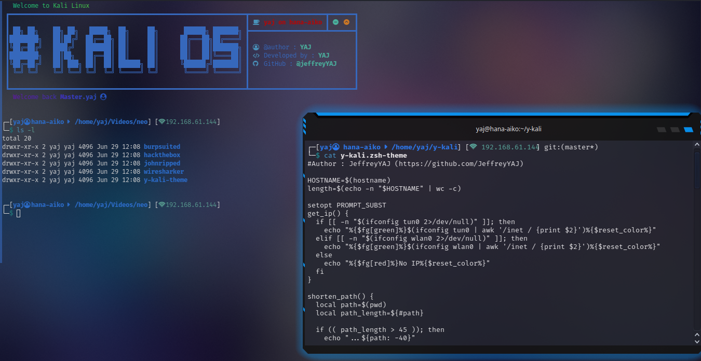

# Y-Zsh prompt theme

## Features 
- Prints a modifiable banner at any new zsh session.
- Prints the user name and hostname.
- Prints the current working directory
- Prints the wlan0 IP if you aren't connected to any VPN.
- Git info

## Showcase

